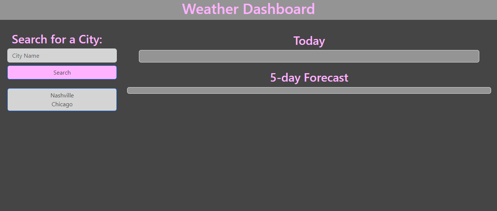
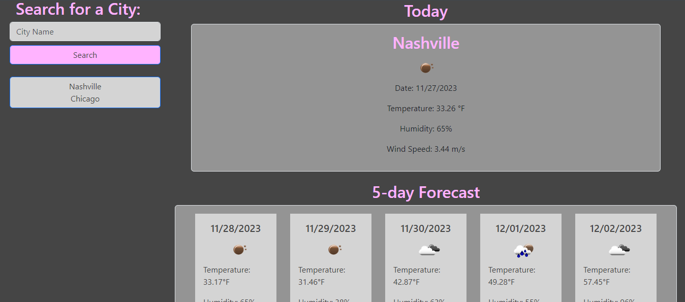

# weather-dashboard

## Description

Challenge 6 -- Server-Side APIs: Weather Dashboard

This project was built so that any user can search for weather in a city and be presented with the current weather, along with a projected 5 day forecast for the coming days. The design was built using bootstrap, and is responsive, but only down to tablet size and is not recommended for mobile use (yet). Throughout this project, I learned how to use server-side API's, and control the parameters & data pulled from those APIs in order to display chosen information. 

Provide a short description explaining the what, why, and how of your project. Use the following questions as a guide:

- What was your motivation?
- Why did you build this project? (Note: the answer is not "Because it was a homework assignment.")
- What problem does it solve?
- What did you learn?

## Usage

Deployed site URL:
https://jskelly8.github.io/weather-dashboard/

Screenshots of deployed site:

## Functionality

** Please allow browser to access your location in order to correctly geocode entered city name ** 

* In the input field under "Search for a City," type the name of a city and click the "Search" button.

* You may also search for a city you've already searched for below the search input to search for that previously viewed one again

## Credits

README template used from: https://coding-boot-camp.github.io/full-stack/github/professional-readme-guide edX Boot Camps LLC. (2022, October 27). Professional readme guide. Professional README Guide | The Full-Stack Blog. https://coding-boot-camp.github.io/full-stack/github/professional-readme-guide

Help from classmate, Andrue, on how to insert icons from the weather API depending on what weather is being shown -- Check out his work on his GitHub: https://github.com/AndrueGage

## Features

* HTML
* CSS
* Bootstrap
* JavaScript
* localStorage
* jQuery
* dayjs
* Server-Side API: OpenWeatherMap